Autor: Sebastian Jimenez
Objetivo: Implementar cliente phpMyadmin conectado con Base de datos MariaDb utilizando docker compose

lo primero que hago abir mi entorno virtualbox con los respectivos poerisos SSH para poder ingrsar desde el CMD y empesar el ejersicio planteado.

Configuracion de MariaDB y PHPmyadmin

 mkdir mariadb_jimenez_sebastian
 cd mariadb_jimenez_sebastian/

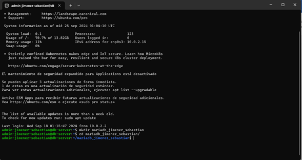

una vez adentro de la carpeta proceso a crear mi archivo docker-compose.yml

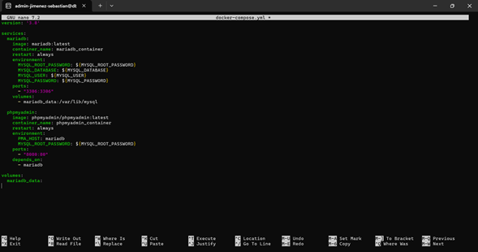

despues proceso a configurar el archivo .env

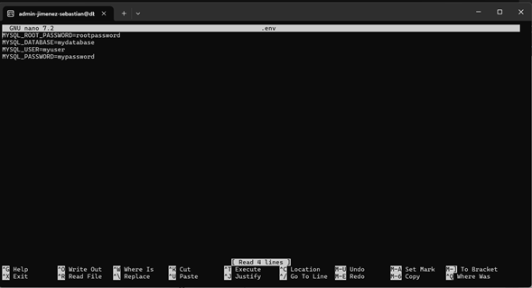

seguimos con env.example

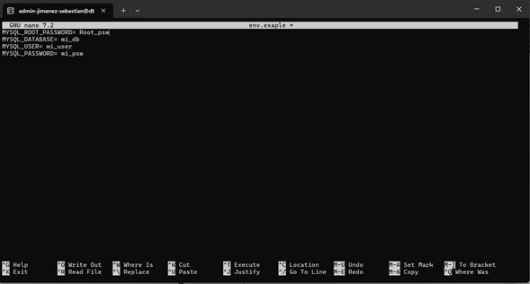

por utlimto creamos el .gitignore

una vez tengamos los archivos anteriores creados procesdemos a iniciar los contenedores con el comando sudo docker-compose up

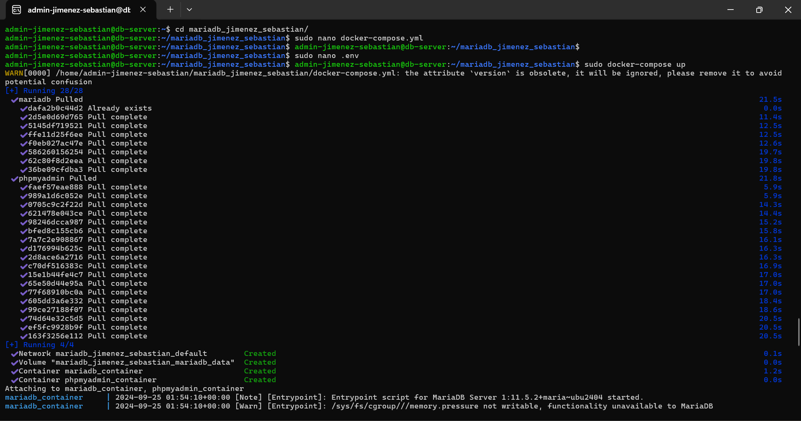

una vez iniciados revisamos el estado de los contenedores con el comando sudo docker ps 

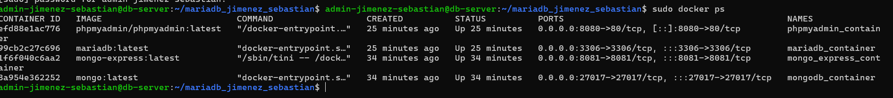

despues de tener los contenedores inicados sin errores vamos al virtual box a configurar los puertos 

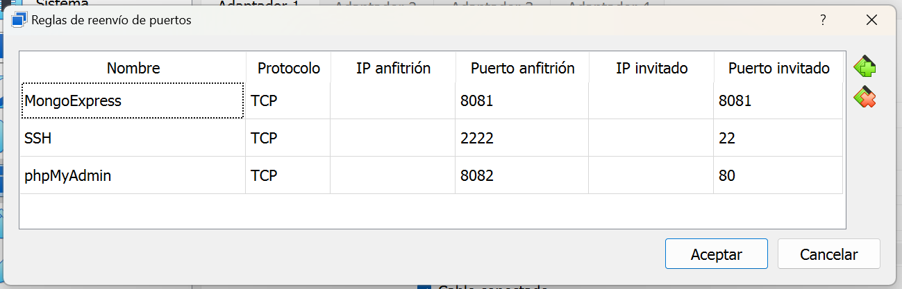

por ultimo para confirar que tenemos ingreso a la base de datos nos vamos a un navegador web y ponemos http://localhost:8080/

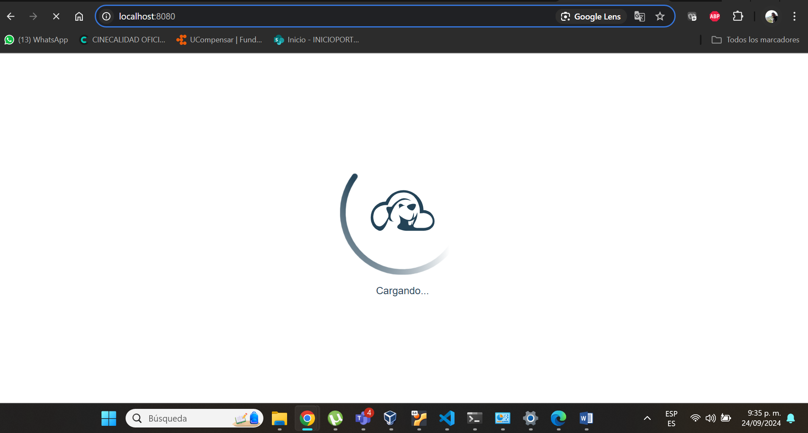

a hora seguimos con el proceso de instalacion y configuracion de MONGODB y Mongo Xpress

lo primero es crear la carpeta segun los lineamientos 

mkdir mongodb_ jimenez_sebastian
cd mongodb_ jimenez_sebastian/

ya en esta ruta procedemos a realizar la creacion de los archivos 

empezamos con docker-compose.yml

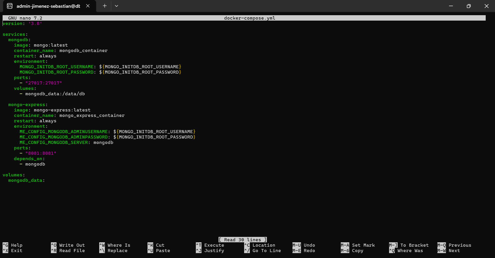

despues vamos con el archivo .env 

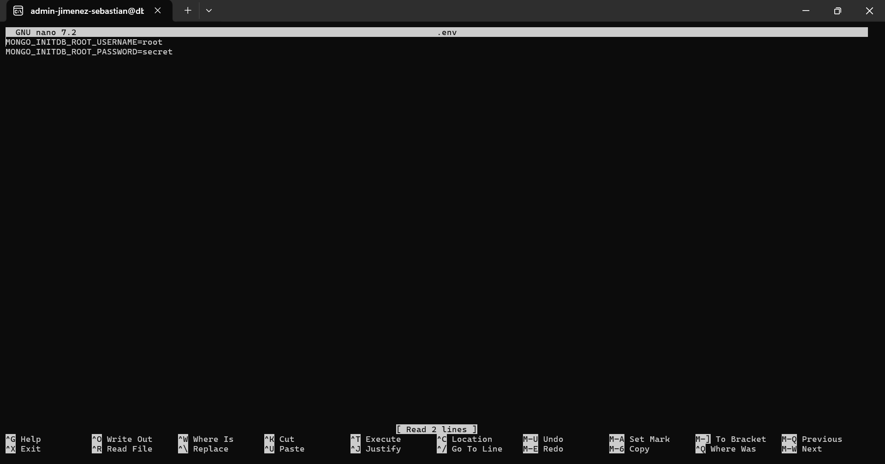

a hora vamos con el .en.example

por ultimo creamos el .gitigonre

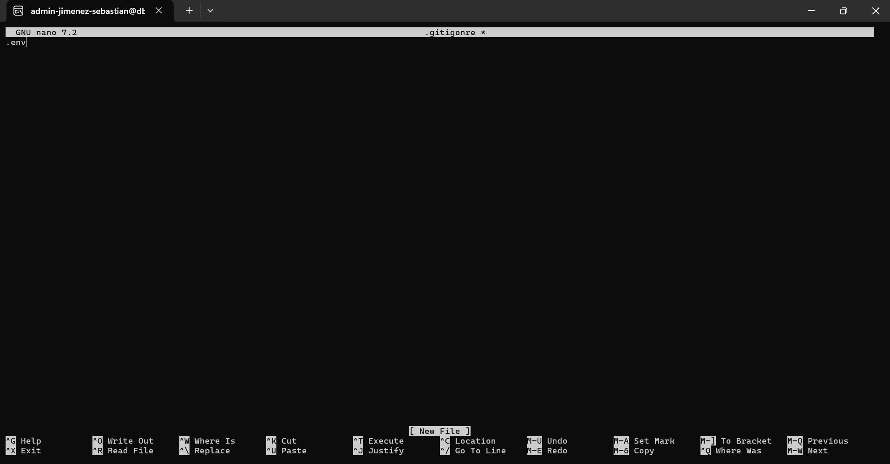

procedemos a iniciar los contenedores con el comando sudo docker-compose up

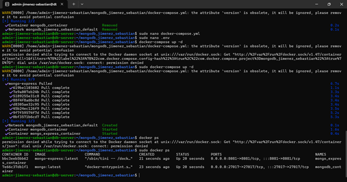

a hora configuramos los puertos en el virtual box 

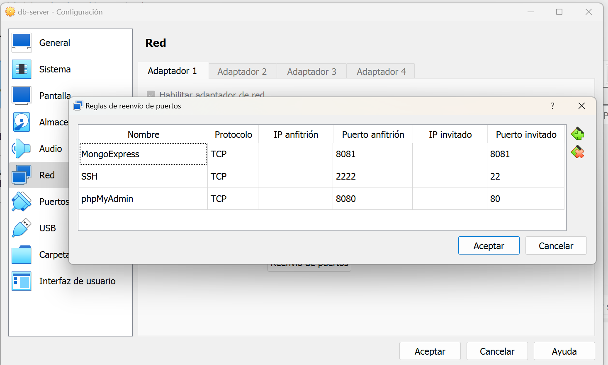

y despues de esto ingresamos a la web con el link: http://localhost:8081/

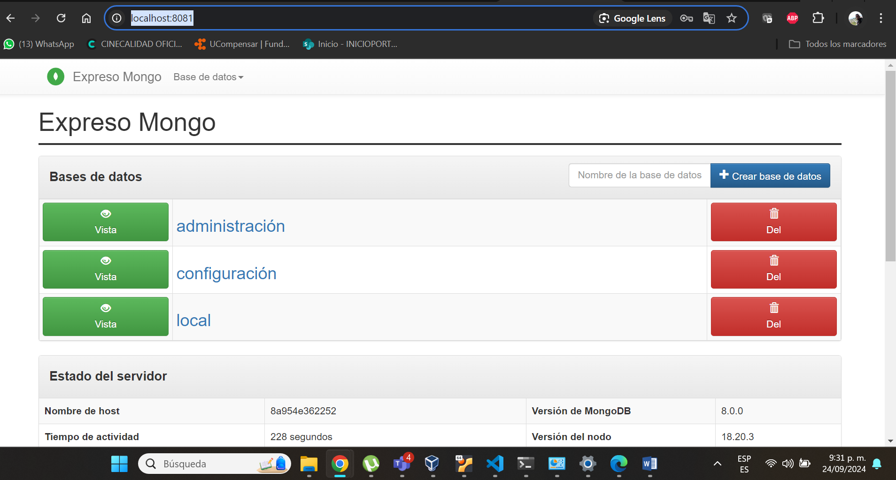